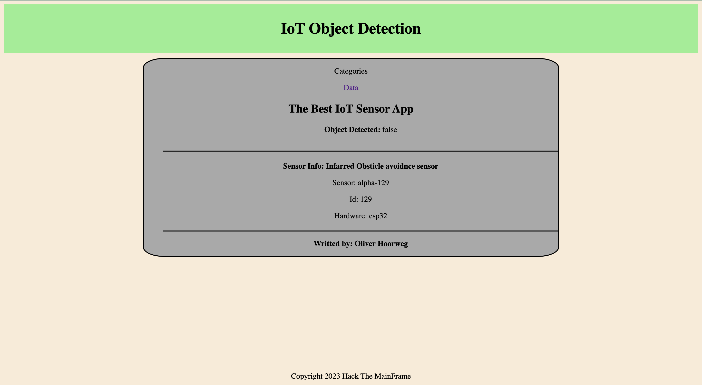

# object_collision
## Object Collision IoT_Project

### Project purpose
To create a webpage that can display whether an object is detected by an object detection module on an Esp32 using Arduino IDE and VS code.

### Completed Steps
1. Setup Github Repo
2. Setup Ardunio IDE and VS Code
3. Install Dependencies for Arduino aREST.h and DHT.h
4. Setup Esp32 with subsequent Arduino IDE code to collect data
5. Initialise Node.js in VS code and install NPM
6. Setup server with express in VS code
7. Set views and routes
8. Set Layout with layouts.ejs
9. Set header and footer in Partials folder
10. Add Package.json file

### References 
(all references are served as a base/reference which was edited to suit the project)
 - [Arduino IDE code to collect data] https://esp32io.com/tutorials/esp32-infrared-obstacle-avoidance-sensor
 - [Webserver and VS code] https://github.com/0LIH/IoT-Weather#readme

   ### Screenshots of Key Changes
- Added Arduino Code: This allows the data from the Esp32 and sensor module to be read,recieved and sent to the web server

- Created Server.js: This sets up the server using express as well as specifying the port the webserver will use.

-Created index.js: this uses fetch to get the API data from Arduino and stores the data in set variables

-Created layouts and partials: This specifies the layout of the website along with the header and footer

-Added Package.json and dependencies: Installs modules and dependencies required for certain parts of the code works

-Added CSS: Styles the webpage to make it appear more appealing and easier to understand

### Final Result of Webpage

   
    
